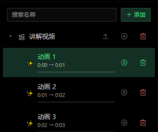
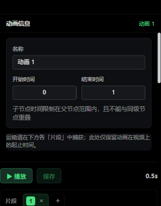
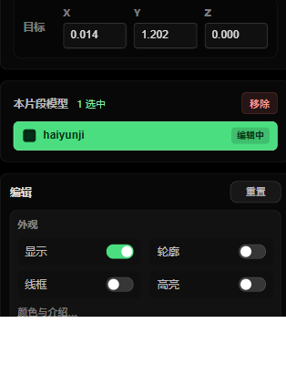
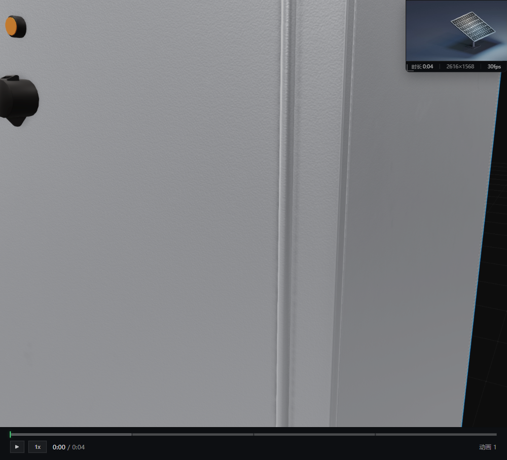
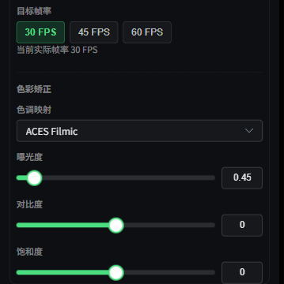
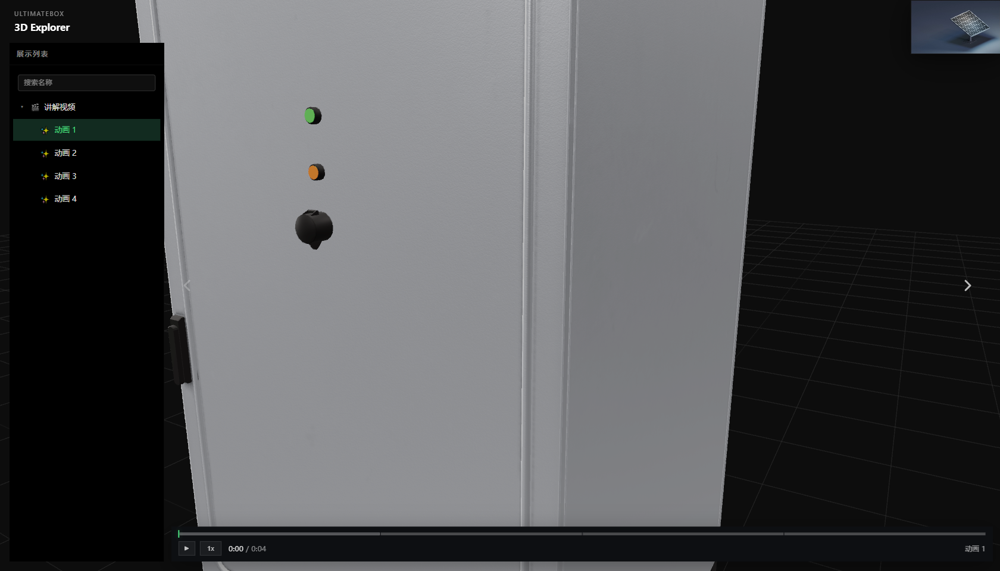

# UltimateBox 3D 场景编辑器使用说明

**文档版本**：2026-08-17　**适用产品**：UltimateBox 3D Explorer

> 编辑 / 展示地址由工作人员另行发放。本文只说明操作，不提供可打开的网址。

---

## 1. 产品用途

将 **讲解视频** 与 **GLB 模型** 按时间对齐：镜头、模型动作、字幕随视频播放。保存后可生成只读展示页。

推荐浏览器：**Chrome / Edge 90+**。

```
分组（可选） → 视频 → 动画节点（视频上的一段时间） → 片段（运镜 + 模型动作）
```

| 对象 | 作用 | 编辑位置 |
|------|------|----------|
| 视频 | 讲解片源 | 左侧节点树 |
| 动画节点 | 视频上的一段讲解；最短 1 秒，同级不可重叠 | 左侧「动画信息」 |
| 片段 | 该段内的运镜与模型姿态 / 外观 | 左侧时间轴 |
| 章节默认外观 | 尚未播到片段时的显示 | 右侧「模型」（未在编片段时） |

**推荐顺序：** 上传视频 → 添加动画并对齐时间 → 片段中捕获运镜 → 点选模型改外观 / 姿态 → 字幕 → 预览 → 顶部「保存 / 更新」→「编辑列表」复制展示链接。


| 区域 | 功能 |
|------|------|
| 顶部 | 名称、新建、预览、编辑列表、保存 / 更新 |
| 左侧 | 节点树；选中动画后编辑时间与片段 |
| 中间 | 3D 视口、视频小窗、进度条 |
| 右侧 | 模型 / 字幕 / 场景 |

## 2. 顶部工具栏


| 按钮 | 说明 |
|------|------|
| 名称 ✏️ | 改场景标题，Enter 确认 |
| 新建 | 空白草稿；有未保存修改会确认 |
| 预览 | 须已有视频 + 至少一个动画。Esc 退出 |
| 编辑列表 | 成功保存过 1 次后可开：修改 / 复制链接 / 删除 |
| 保存 / 更新 | 须视频 + 动画。橙色圆点 = 有未保存修改。保存中勿关页 |


展示链接交给观看方或由工作人员转发，勿使用文档中的示例地址。

## 3. 节点树



「＋ 添加」可建 **分组** 或 **视频**。分组行上的「+」可继续加子分组 / 子视频。搜索按名称过滤；**仅视频节点**可拖入分组。

| 节点 | 行内操作 |
|------|----------|
| 视频 | ⬆ 上传 / 替换（建议 MP4）→ 成功后出现小窗；⊕ 添加动画；🗑 删除（含子动画） |
| 动画 | ▶ 播放该段；🗑 删除。默认 1 秒，结束须 ≥ 开始 + 1 秒 |

选中动画后，下方只改 **名称、开始 / 结束**。运镜在片段里捕获。

## 4. 动画片段

选中动画节点后，在下方设置起止时间，并用「片段」编辑运镜与模型动作。



| 操作 | 说明 |
|------|------|
| ▶ 播放 | 按顺序预览本动画全部片段 |
| 保存 | 写入本动画的片段（顶部「更新」才提交整场） |
| 数字芯片 | 切换片段；「+」新建；「×」删除（至少留 1 个） |
| 起 / 止 | 本片段时间窗；必须播完才进下一段 |
| 捕获视口 | 把当前镜头写入本片段 |
| 过渡 | 切到本镜头的时长，**0 = 瞬切** |
| FOV | 约 20°–120° |

视口：**左键旋转、滚轮缩放、右键平移** →「捕获视口」→「播放」检查衔接。

**两套时间互不绑定：** 片段起止是时间窗；模型「间隔 / 起始→结束」是姿态插值（可为 0）。要对齐结束，把窗长与姿态时长调成一致。



视口或右侧树点选模型，即加入当前片段。Shift 范围多选，Ctrl / ⌘ 追加。标记：**已改** 已写入，**编辑中** 未提交，**选中** 多选中。

| 外观 | 姿态 |
|------|------|
| 显示 / 轮廓 / 线框 / 高亮；「颜色与介绍…」可改色和气泡文字 | 「起始 / 结束」：位置、缩放、旋转；间隔、起始→结束、曲线、旋转中心 |

流程：选片段 → 捕获运镜 → 点模型 → 改外观与起止姿态 → 时间轴「播放」→「保存」→ 顶部「更新」。

## 5. 视口



| 操作 | 作用 |
|------|------|
| 单击模型 | 选中并聚焦（点空白取消） |
| Shift / Ctrl + 单击 | 加入当前片段多选 |
| 视频小窗 | 与 3D 同步。编辑时可拖动、拖角缩放；位置按动画节点记忆。✕ 移除视频 |
| 进度条 | ▶ 播放；倍速 1 / 1.25 / 1.5 / 2 / 0.5；点击分段跳转 |

字幕出现在视口底部；介绍文字以气泡跟在模型旁。均只在对应时段显示。

## 6. 模型 · 字幕 · 场景

### 模型


列表为当前场景 GLB。点卡片聚焦；🗑 仅从本场景移除。树中 Group / Mesh / Bone 可单独选。编片段时，外观请在左侧时间轴改。

未编片段时，右侧为 **章节默认外观**：显示、轮廓、线框、高亮、是否播动画、介绍文字。

### 字幕


绑定当前动画节点。填开始 / 结束（整数秒）、文本（≤100 字）、文字色 / 背景色 →「＋ 添加字幕」。点列表项可改，🗑 删除。

### 场景（全局，对所有动画生效）


| 区块 | 要点 |
|------|------|
| 灯光 | 环境光强度；「+ 添加灯光」：平行光 / 聚光灯 / 点光源。选中后调颜色、强度、位置、方向、阴影 |
| 材质 | 先在模型树选中对象，再改颜色；子部件只改该部件 |
| 后处理 | Bloom、GTAO、抗锯齿（FXAA / SMAA / SSAA）、采样倍数、30/45/60 FPS、色调映射（建议 ACES Filmic）、曝光 / 对比度 / 饱和度 |
| 环境 | HDR（.hdr）、旋转 / 强度、镜面反射、雾、阴影、网格。展示时建议关网格 |
| 重置 | 面板底栏，恢复默认 |



## 7. 预览与展示


| | 预览 | 展示 |
|---|------|------|
| 进入 | 顶部「预览」 | 工作人员发放的 `mode=view` 链接，无需登录 |
| 顶栏 | UltimateBox 预览 | UltimateBox 3D Explorer |
| 编辑 | 可退出再改 | 只读 |

| 操作 | 方式 |
|------|------|
| 播放 / 暂停 | 播放按钮、空格、**双击**视口（单击不切换，防误触） |
| 上 / 下一段 | 视口 ◀ ▶ 或 ← →（只切段，不暂停） |
| 跳转 | 进度条分段；列表可选段落 |
| 退出预览 | 「退出预览」或 Esc |



分享前：时间轴「保存」→ 顶部「更新」→「编辑列表」→「复制链接」。编辑 `code` 与展示 `code` 不同，展示编号在首次保存后生成。

## 8. 快捷键与限制

| 键 | 功能 | 范围 |
|----|------|------|
| 空格 | 播放 / 暂停 | 编辑 / 预览 / 展示 |
| ← → | 上 / 下一段 | 同上 |
| Esc | 退出预览 | 预览 |
| 单击 / Shift / Ctrl+单击 | 选模型 | 编辑 |

在输入框内快捷键不生效。视频建议 MP4（< 200MB），模型 GLB/GLTF（单文件建议 < 50MB）。

## 9. 常见问题

| 现象 | 处理 |
|------|------|
| 一直「正在初始化…」 | 刷新；换 Chrome / Edge；查网络 |
| 预览灰掉 | 先上传视频并添加动画节点 |
| 保存灰掉 | 同上，且当前不在保存中。片段改完先点时间轴「保存」 |
| 时间改不了 | 须在视频时长内、≥1 秒、同级不重叠 |
| 看不到模型 | 确认场景已绑定 GLB；检查「显示」与片段外观 |
| 镜头不对 | 先调视口再「捕获视口」；运镜只在 **当前片段** |
| 动作完了还停 | 片段窗长 > 姿态时长。把止点与姿态时长对齐 |
| 右侧高亮预览无效 | 播放以 **片段外观** 为准 |
| 编辑列表打不开 | 链接须带编辑场景编号，且已成功保存过 1 个场景 |

---

*问题请联系 UltimateBox 技术支持。*
