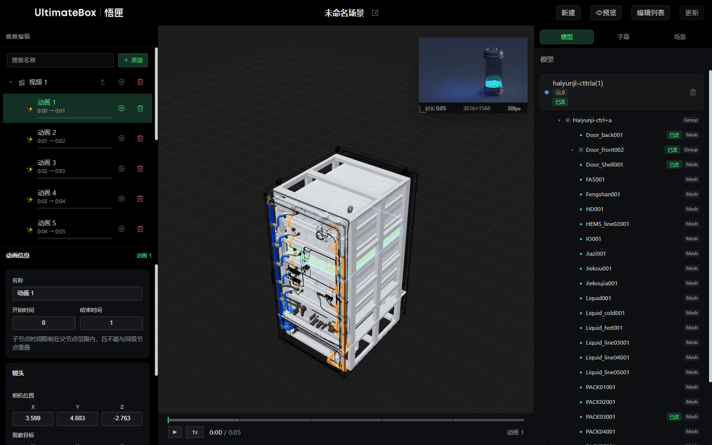
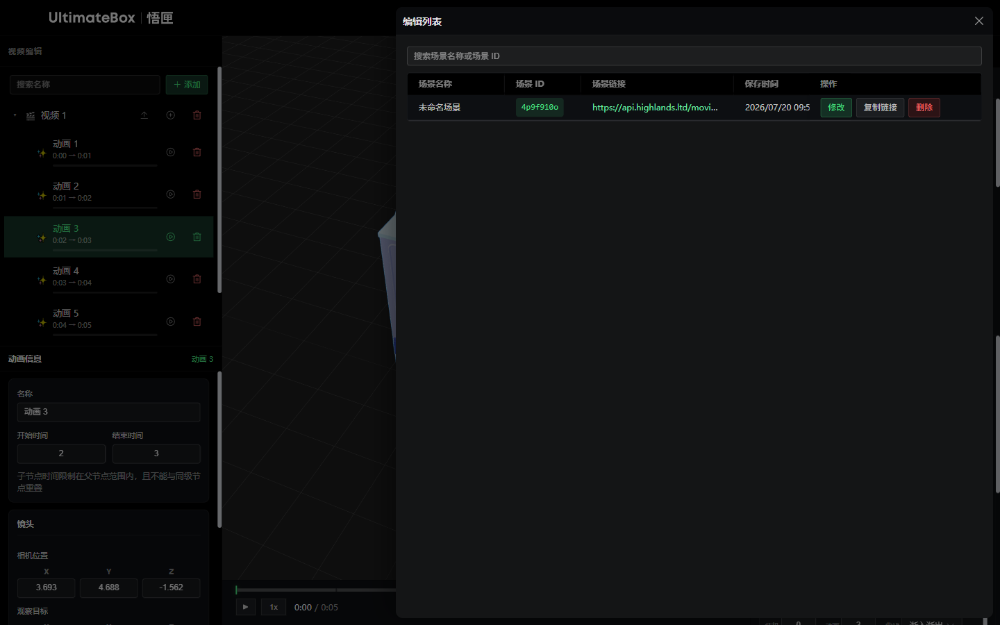
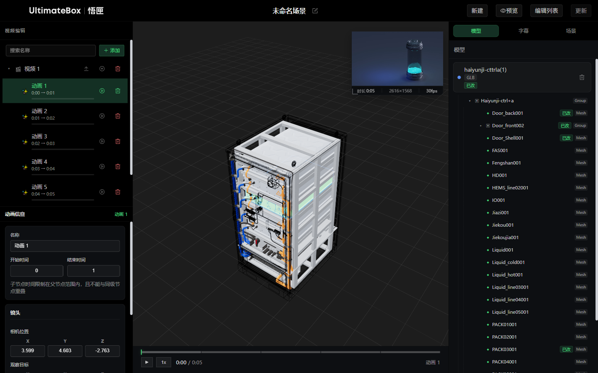
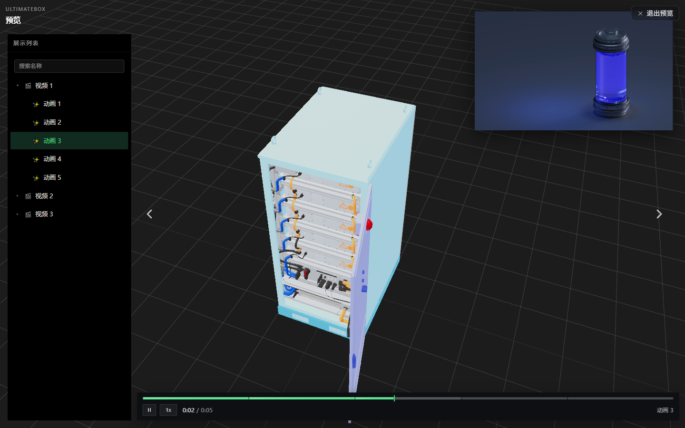
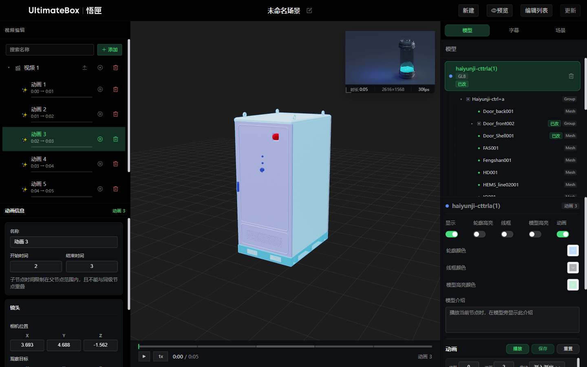
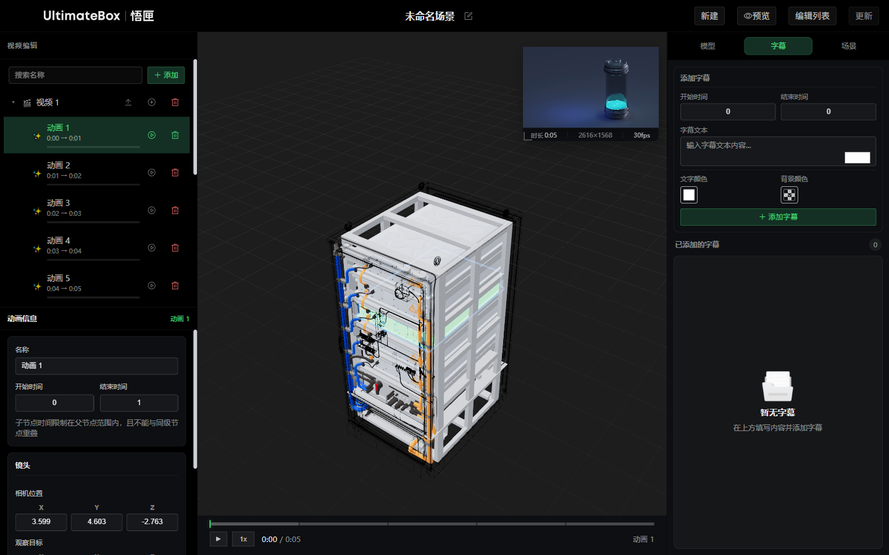
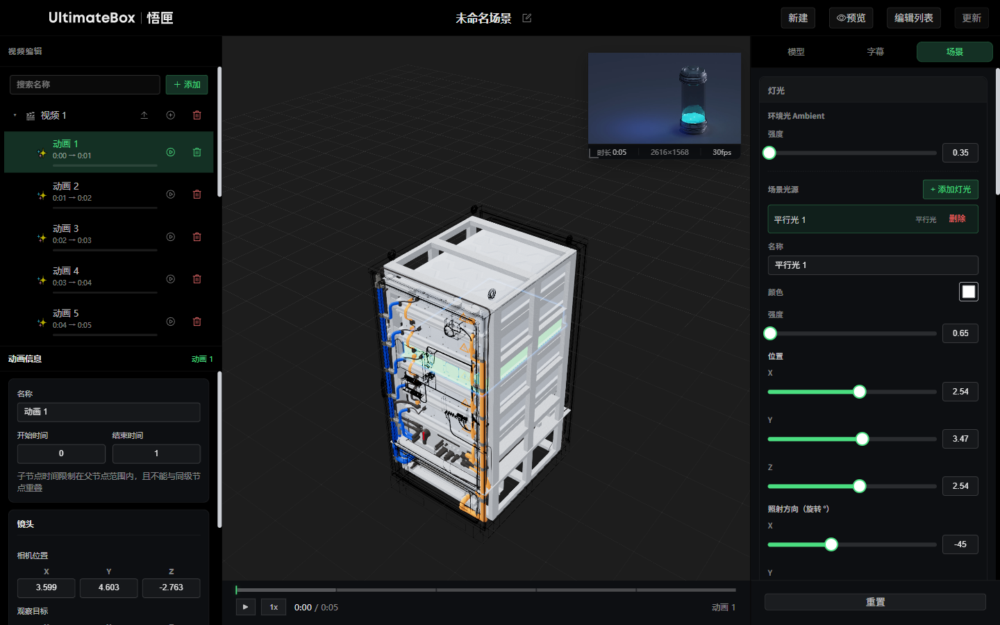

# UltimateBox 3D 场景编辑器 — 客户使用说明

> **适用链接示例**  
> 编辑地址：`https://api.highlands.ltd/movie-editor/#/project/editor?code=rsp8d9ws&id=project_38`  
> 展示地址：`https://api.highlands.ltd/movie-editor/#/project/editor?mode=view&code=场景ID`

**文档版本**：2026-07-20  
**适用产品**：UltimateBox 3D Explorer / Movie Model Editor

---

## 目录

1. [产品简介](#1-产品简介)
2. [快速开始](#2-快速开始)
3. [界面总览](#3-界面总览)
4. [顶部工具栏](#4-顶部工具栏)
5. [左侧：视频编辑（节点树）](#5-左侧视频编辑节点树)
6. [中间：3D 视口与播放控制](#6-中间3d-视口与播放控制)
7. [右侧：模型面板](#7-右侧模型面板)
8. [右侧：字幕面板](#8-右侧字幕面板)
9. [右侧：场景面板](#9-右侧场景面板)
10. [预览模式](#10-预览模式)
11. [展示模式（给客户看的链接）](#11-展示模式给客户看的链接)
12. [场景保存与管理](#12-场景保存与管理)
13. [快捷键一览](#13-快捷键一览)
14. [常见问题](#14-常见问题)

---

## 1. 产品简介

UltimateBox 3D 场景编辑器是一款 **视频 + 3D 模型联动** 的在线编辑工具。您可以将讲解视频与 3D 模型结合，按时间节点配置：

- **动画节点**：每个时间段对应一个镜头视角和模型状态
- **模型效果**：显示/隐藏、高亮、线框、位移/旋转/缩放动画
- **字幕**：在指定时间段显示文字说明
- **场景环境**：灯光、HDR 环境、雾效、阴影、后处理等

编辑完成后，点击 **保存/更新** 即可生成可分享给客户的 **展示链接**。

---

## 2. 快速开始

### 2.1 打开编辑器

1. 在浏览器（推荐 Chrome / Edge）中打开您的编辑链接
2. 等待页面显示 **「正在初始化编辑器...」**，场景、模型与视口就绪后即可操作
3. 首次加载完成后，界面分为 **左（节点）· 中（3D 视口）· 右（参数）** 三栏

### 2.2 典型工作流程

```
上传视频 → 添加动画节点 → 调整镜头 → 配置模型 → 添加字幕 → 预览 → 保存 → 分享展示链接
```

| 步骤 | 操作位置 | 说明 |
|------|----------|------|
| 1 | 左侧节点树 | 添加「视频」节点并上传 MP4 视频 |
| 2 | 左侧节点树 | 在视频下添加「动画」节点，设置起止时间 |
| 3 | 左侧详情 + 3D 视口 | 拖动视角后点击「捕获当前视角」 |
| 4 | 右侧「模型」 | 选中模型，配置显示、高亮、动画等 |
| 5 | 右侧「字幕」 | 填写时间段与文字内容 |
| 6 | 顶部「预览」 | 全屏预览最终效果 |
| 7 | 顶部「更新」 | 保存到服务器 |
| 8 | 顶部「编辑列表」 | 复制展示链接发给客户 |

---

## 3. 界面总览



| 区域 | 名称 | 主要功能 |
|------|------|----------|
| **顶部** | 工具栏 | 场景名称、新建、预览、编辑列表、保存 |
| **左侧** | 视频编辑 | 节点树（分组 / 视频 / 动画）、节点详情 |
| **中间** | 3D 视口 | 实时 3D 预览、视频小窗、进度条 |
| **右侧** | 参数面板 | 模型 / 字幕 / 场景 三个标签页 |

---

## 4. 顶部工具栏



### 4.1 场景名称

- 点击标题右侧的 **铅笔图标** 可编辑场景名称
- 编辑完成后按 **Enter** 或点击空白处保存
- 场景名称会显示在「编辑列表」和展示页面中

### 4.2 新建

- 点击 **「新建」** 创建空白场景草稿
- 若当前场景有未保存修改，系统会弹出确认提示
- 新建后将清空当前视频、节点和模型配置

### 4.3 预览

- 点击 **「预览」** 进入全屏预览模式（需已上传视频且至少有一个动画节点）
- 预览模式下隐藏右侧编辑面板，模拟客户最终看到的效果
- 点击 **「退出预览」** 或按 **Esc** 返回编辑

### 4.4 编辑列表

- 至少 **保存过一次** 场景后才可打开
- 列表显示：场景名称、场景 ID、展示链接、保存时间
- 支持 **搜索** 场景名称或 ID
- 每行操作：
  - **修改**：加载该场景到编辑器
  - **复制链接**：复制展示链接到剪贴板
  - **删除**：永久删除该场景（不可恢复，请谨慎操作）

### 4.5 保存 / 更新

- 首次保存显示 **「保存」**，之后显示 **「更新」**
- 按钮旁 **橙色圆点** 表示有未保存的修改
- 保存条件：已上传视频 + 至少一个动画节点 + 存在未保存修改
- 保存过程中会显示「正在保存...」提示，请勿关闭页面

---

## 5. 左侧：视频编辑（节点树）

节点树是编辑器的核心结构，采用 **树形层级** 组织内容：

```
分组（可选）
└── 视频
    ├── 动画 1  （0:00 → 0:01）
    ├── 动画 2  （0:01 → 0:02）
    └── 动画 3  ...
```

### 5.1 添加节点

1. 点击节点树上方的 **「＋ 添加」** 按钮
2. 选择节点类型：
   - **分组**：用于组织多个视频，可嵌套
   - **视频**：承载一段讲解视频

> 在 **分组** 节点上，也可点击行右侧 **「+」** 图标，添加子分组或子视频。

### 5.2 视频节点操作

选中视频节点后，行右侧出现三个图标：

| 图标 | 功能 | 说明 |
|------|------|------|
| ⬆ 上传 | 上传 / 替换视频 | 支持 MP4 / WebM / OGV |
| ⊕ 添加 | 添加动画节点 | 需先上传视频后才可用 |
| 🗑 删除 | 删除该视频节点 | 连同下属动画一并删除 |

**上传视频步骤：**

1. 点击视频行右侧的 **上传图标**
2. 在文件选择器中选择本地视频文件
3. 上传成功后，视频名称旁不再显示「未上传视频」提示
4. 中间视口会出现 **视频小窗（PiP）**，与 3D 场景同步播放

> **提示**：视频节点的名称可在选中后，于左下方「视频信息」面板中修改。

### 5.3 动画节点操作

每个 **动画节点** 对应视频中的一段时间段，是该时段内 3D 镜头和模型效果的配置单元。

| 图标 | 功能 |
|------|------|
| ▶ / ⏸ | 播放 / 暂停该动画片段 |
| 🗑 | 删除该动画节点 |

**添加动画节点：**

1. 确保视频已上传
2. 点击视频行右侧 **「+」** 图标
3. 系统自动创建新动画节点，默认占用 1 秒时长
4. 点击动画节点，在下方详情面板调整时间与镜头

### 5.4 动画节点详情（时间与镜头）



选中动画节点后，左下方显示 **「动画信息」** 面板：

#### 基本信息

| 字段 | 说明 |
|------|------|
| **名称** | 动画节点显示名称 |
| **开始时间** | 该段动画在视频中的起始秒数 |
| **结束时间** | 该段动画在视频中的结束秒数 |

> **注意**：子节点（动画）的时间必须在其父视频时长范围内，且同级动画之间 **不能时间重叠**。

#### 镜头设置

| 字段 | 说明 |
|------|------|
| **相机位置 (X/Y/Z)** | 3D 相机的空间坐标 |
| **观察目标 (X/Y/Z)** | 相机看向的目标点坐标 |
| **FOV** | 视野角度，范围 10°–60°，数值越大视野越广 |
| **运镜时长（秒）** | 从上一段动画切换到本段时的镜头过渡时间 |

**推荐操作方式 — 捕获当前视角：**

1. 在中间 3D 视口中，用鼠标调整到你想要的视角：
   - **左键拖动**：旋转视角
   - **滚轮**：缩放
   - **右键拖动**：平移
2. 回到左侧详情面板，点击 **「捕获当前视角」**
3. 系统自动填入当前相机位置、观察目标和 FOV

### 5.5 搜索与拖拽

- **搜索**：在搜索框输入名称关键词，自动过滤并展开匹配节点
- **拖拽排序**：可拖动视频节点到分组中 reorganize 结构
  - 拖入允许区域显示 ⬇ 提示
  - 不允许的位置显示 🚫 禁止图标

---

## 6. 中间：3D 视口与播放控制

### 6.1 3D 视口交互

| 操作 | 鼠标 | 效果 |
|------|------|------|
| 旋转 | 左键拖动 | 环绕观察 3D 模型 |
| 缩放 | 滚轮 | 拉近 / 推远 |
| 平移 | 右键拖动 | 平移观察位置 |

视口右上角显示 **时长、分辨率、帧率** 等状态信息。

### 6.2 视频小窗（PiP）

- 上传视频后，视口左下角出现 **视频小窗**
- 小窗与 3D 场景 **同步播放**，方便对照调整
- 编辑模式下可 **拖动小窗位置** 和 **调整大小**
- 点击小窗右上角 **✕** 可移除视频

### 6.3 底部进度条



| 控件 | 功能 |
|------|------|
| ▶ / ⏸ | 播放 / 暂停 |
| **1x** | 切换播放倍速（点击循环切换） |
| 时间显示 | 当前时间 / 总时长 |
| 彩色分段条 | 各动画节点的时间段，点击可跳转 |
| 播放头 | 白色竖线，指示当前播放位置 |

> 点击进度条任意位置可 **跳转到对应时间**。

### 6.4 模型介绍气泡

若在模型面板中填写了 **「模型介绍」** 文字，播放对应动画节点时，文字会以气泡形式显示在模型旁边。

### 6.5 字幕显示

配置字幕后，字幕文字会显示在 3D 视口底部区域，仅在对应时间段内出现。

---

## 7. 右侧：模型面板



点击右侧 **「模型」** 标签页进入。需先 **选中左侧的一个动画节点**，再在此配置该时段内的模型效果。

### 7.1 模型列表

- 显示当前场景中所有 3D 模型（GLB 格式）
- 每个模型卡片显示：**名称**、**类型标签**（GLB / Primitive）
- 已修改过的模型显示 **「已改」** 标记
- 点击模型卡片可选中并在视口中聚焦
- 点击 **🗑** 可删除模型

#### 模型层级树

GLB 模型展开后可看到内部结构：

- **Group**：模型组，可继续展开
- **Mesh**：具体网格部件，可单独选中配置

> 选中子部件后，右侧配置仅作用于该部件，不影响模型其他部分。

### 7.2 模型基础设置

选中模型后，下方出现配置区域：

| 开关 | 功能 |
|------|------|
| **显示** | 控制模型在当前动画节点是否可见 |
| **轮廓高亮** | 模型边缘发光轮廓，可设置颜色 |
| **线框** | 以线框模式显示，可设置颜色 |
| **模型高亮** | 整体高亮填充，可设置颜色 |
| **动画** | 是否播放该模型的位移动画 |

| 字段 | 功能 |
|------|------|
| **轮廓颜色** | 轮廓高亮的颜色（需开启轮廓高亮） |
| **线框颜色** | 线框的颜色（需开启线框） |
| **模型高亮颜色** | 高亮填充的颜色（需开启模型高亮） |
| **模型介绍** | 播放时在模型旁显示的介绍文字 |

> 所有修改 **实时生效**，可在 3D 视口中即时查看效果。

### 7.3 模型动画配置

在基础设置下方，展开 **「动画」** 区域：

#### 操作按钮

| 按钮 | 功能 |
|------|------|
| **播放** | 预览当前动画效果（播放中按钮显示「播放中...」） |
| **保存** | 保存动画配置（有未保存修改时才可点击） |
| **重置** | 恢复动画到初始状态 |

#### 时间与曲线

| 参数 | 说明 | 范围 |
|------|------|------|
| **待机** | 动画开始前的等待时间 | 0–10 秒 |
| **动画** | 动画执行时长 | 0.5–30 秒 |
| **曲线** | 动画缓动曲线（如 easeInOut 等） | 下拉选择 |

#### 起始状态 / 结束状态

展开 **「起始状态」** 和 **「结束状态」** 可分别设置：

| 参数 | 说明 |
|------|------|
| 位置 X / Y / Z | 模型偏移位置 |
| 缩放 | 模型缩放比例 |
| 旋转 X / Y / Z | 模型旋转角度（度） |

#### 旋转中心点

选择模型旋转时的轴心位置：中心、上方、下方、左方、右方、前方、后方。

**配置动画的推荐流程：**

1. 选中动画节点 → 选中模型
2. 展开「起始状态」，设置模型初始位置/旋转/缩放
3. 展开「结束状态」，设置模型最终位置/旋转/缩放
4. 调整「待机」和「动画」时长
5. 点击 **「播放」** 预览效果
6. 满意后点击 **「保存」**

---

## 8. 右侧：字幕面板



点击右侧 **「字幕」** 标签页进入。字幕绑定到 **当前选中的动画节点**。

### 8.1 添加字幕

1. 在左侧选中目标动画节点
2. 填写字幕表单：

| 字段 | 说明 |
|------|------|
| **开始时间** | 字幕出现的秒数（整数） |
| **结束时间** | 字幕消失的秒数（整数） |
| **字幕文本** | 显示的文字内容（有字数限制） |
| **文字颜色** | 字幕文字颜色 |
| **背景颜色** | 字幕背景颜色（支持透明度） |

3. 点击 **「＋ 添加字幕」**

### 8.2 管理字幕

- 下方 **「已添加的字幕」** 列表显示当前节点的所有字幕
- **点击** 某条字幕可加载到上方表单进行编辑，然后点击 **「确认修改」**
- 点击字幕右侧 **🗑** 可删除

> 字幕只在对应时间段内显示，可在预览模式中验证效果。

---

## 9. 右侧：场景面板



点击右侧 **「场景」** 标签页进入。此处配置全局 3D 场景环境，对所有动画节点生效。

### 9.1 灯光

#### 环境光 (Ambient)

- **强度**：控制整体基础亮度（0–50）

#### 场景光源

1. 点击 **「+ 添加灯光」**，选择类型：
   - **平行光 (Directional)**：模拟太阳光，可投射阴影
   - **聚光灯 (Spot)**：锥形光束，可设置角度和边缘柔化
   - **点光源 (Point)**：向四周发光

2. 选中灯光后可调整：

| 参数 | 说明 |
|------|------|
| 名称 | 灯光标识名 |
| 颜色 | 光的颜色 |
| 强度 | 光照强度 |
| 位置 X/Y/Z | 光源位置 |
| 照射方向 | 旋转角度（平行光/聚光灯） |
| 投射阴影 | 是否产生阴影（平行光） |
| 距离 / 衰减 | 点光源/聚光灯的照射范围和衰减 |

3. 点击灯光行右侧 **「删除」** 移除该光源

### 9.2 材质

需先在 **「模型」** 标签页选中一个模型，再回到此处调整材质：

| 参数 | 说明 | 范围 |
|------|------|------|
| 颜色 | 模型表面颜色 | 色板选择 |
| 粗糙度 | 表面粗糙程度 | 0（光滑）– 1（粗糙） |
| 金属度 | 金属质感程度 | 0 – 1 |
| 法线强度 | 表面细节凹凸感 | 0 – 5 |
| 自发光 | 模型自身发光强度 | 0 – 5 |

> 若选中了模型的某个 **子部件 (Mesh)**，材质修改仅作用于该部件。

### 9.3 后处理

| 模块 | 参数 | 说明 |
|------|------|------|
| **辉光 Bloom** | 强度 / 阈值 / 半径 | 高光区域的柔和发光效果 |
| **抗锯齿** | 模式 / MSAA / 渲染采样倍数 | 边缘平滑度，影响性能 |
| **渲染帧率** | 30 / 45 / 60 FPS | 目标渲染帧率 |
| **色彩矫正** | 色调映射 / 曝光度 / 对比度 / 饱和度 | 整体画面色彩风格 |

### 9.4 环境

| 模块 | 参数 | 说明 |
|------|------|------|
| **HDR 环境贴图** | 上传 / 更换 / 恢复默认 | 控制环境反射和背景光照 |
| | 环境旋转 / 强度 | 调整 HDR 贴图方向和影响 |
| | 模型镜面反射 | 增强玻璃等材质的反射感 |
| **雾效 Fog** | 启用 / 近距 / 远距 | 远处渐隐的雾效果 |
| **阴影 Shadow** | 启用 / 强度 / 贴图大小 / 类型 | 全局阴影设置 |
| **网格 Grid** | 显示 / 大小 / 细分 / 高度 | 地面参考网格 |

### 9.5 重置

点击面板底部 **「重置」** 按钮，可将所有场景设置恢复为默认值。

---

## 10. 预览模式


### 10.1 进入预览

1. 确保已上传视频且至少有一个动画节点
2. 点击顶部 **「预览」** 按钮
3. 界面切换为预览布局：
   - 顶部显示 **UltimateBox 预览** 品牌标识
   - 右侧编辑面板隐藏
   - 左侧节点树变为预览抽屉

### 10.2 预览模式操作

| 操作 | 方式 |
|------|------|
| 播放 / 暂停 | 点击视口中央播放按钮，或按 **空格键**，或 **双击视口** |
| 上一段 / 下一段 | 视口两侧的 **◀ ▶** 箭头按钮，或按 **← →** 方向键 |
| 跳转进度 | 点击底部进度条的彩色分段 |
| 查看节点列表 | 点击右上角 **列表图标**，打开节点抽屉 |
| 退出预览 | 点击 **「退出预览」** 或按 **Esc** |

### 10.3 预览 vs 展示

| | 预览模式 | 展示模式 |
|---|---------|---------|
| 进入方式 | 编辑页点击「预览」 | 打开 `mode=view` 的展示链接 |
| 能否编辑 | 可以，退出后回到编辑 | 只读，无法编辑 |
| 界面 | 与展示基本一致 | 品牌标题为「3D Explorer」 |

---

## 11. 展示模式（给客户看的链接）

### 11.1 获取展示链接

1. 在编辑器中完成配置并 **保存/更新** 场景
2. 点击顶部 **「编辑列表」**
3. 找到目标场景，点击 **「复制链接」**
4. 将链接发送给客户

展示链接格式示例：

```
https://api.highlands.ltd/movie-editor/#/project/editor?mode=view&code=rsp8d9ws
```

### 11.2 客户如何使用展示链接

1. 在浏览器中打开链接，无需登录
2. 页面自动加载 3D 场景和视频
3. 操作方式与预览模式相同：
   - **双击屏幕** 或点击播放按钮开始/暂停
   - 使用 **◀ ▶** 切换不同讲解段落
   - 点击右上角 **列表图标** 查看所有节点并跳转
4. 移动端同样支持触摸操作

---

## 12. 场景保存与管理

### 12.1 保存时机

建议在以下情况及时保存：

- 完成一批动画节点配置后
- 调整完模型效果或场景灯光后
- 准备分享展示链接之前
- 关闭浏览器标签页之前

### 12.2 未保存提示

- 顶部 **「更新」** 按钮旁的 **橙色圆点** = 有未保存修改
- 点击 **「新建」** 时，若有未保存修改会弹出确认对话框

### 12.3 编辑列表功能

| 功能 | 说明 |
|------|------|
| 搜索 | 按场景名称或场景 ID 搜索 |
| 修改 | 加载已有场景到编辑器继续编辑 |
| 复制链接 | 复制该场景的展示链接 |
| 删除 | 永久删除场景（不可恢复） |

---

## 13. 快捷键一览

| 快捷键 | 功能 | 适用模式 |
|--------|------|----------|
| **空格** | 播放 / 暂停 | 编辑 / 预览 / 展示 |
| **←** | 上一段动画 | 预览 / 展示 |
| **→** | 下一段动画 | 预览 / 展示 |
| **Esc** | 退出预览 | 预览模式 |

> 在输入框（名称、时间等）中输入时，快捷键不会触发。

---

## 14. 常见问题

### Q1：打开链接后一直显示「正在初始化编辑器...」

- 检查网络连接是否正常
- 尝试刷新页面（F5）
- 确认浏览器为 Chrome / Edge 等现代浏览器
- 若持续无法加载，请联系技术支持

### Q2：「预览」按钮是灰色的，无法点击

需同时满足：
1. 已上传视频
2. 至少有一个动画节点

### Q3：「更新」按钮是灰色的

需同时满足：
1. 已上传视频
2. 至少有一个动画节点
3. 存在未保存的修改（修改任意配置后按钮才会激活）

### Q4：动画节点时间无法设置

- 开始/结束时间必须在视频时长范围内
- 同级动画节点的时间段不能重叠
- 子节点时间不能超出父视频范围

### Q5：视频上传后看不到 3D 模型

- 确认场景中已包含 3D 模型（通常随场景一起保存/加载）
- 检查模型面板中 **「显示」** 开关是否开启
- 尝试选中模型卡片，视口会自动聚焦到模型

### Q6：捕获当前视角后镜头不对

- 确保在点击「捕获」前，已在 3D 视口中调整到满意的角度
- FOV 值影响视野广度，可在捕获后微调
- 「运镜时长」控制从上一段切换到本段的过渡速度

### Q7：如何给客户分享最终效果？

1. 点击 **「更新」** 保存最新修改
2. 打开 **「编辑列表」**
3. 点击 **「复制链接」**
4. 将 `mode=view` 的链接发给客户

### Q8：编辑链接和展示链接有什么区别？

| | 编辑链接 | 展示链接 |
|---|---------|---------|
| URL 参数 | `code=xxx&id=project_xx` | `mode=view&code=xxx` |
| 能否修改 | ✅ 可以编辑 | ❌ 只读浏览 |
| 适用对象 | 内部制作人员 | 最终客户 |

### Q9：支持哪些浏览器？

推荐使用 **Chrome 90+** 或 **Edge 90+**。Firefox 和 Safari 基本可用，但 3D 渲染性能可能略低。

### Q10：视频和模型文件大小有限制吗？

- 视频：建议使用 MP4 格式，文件不宜过大（建议 < 200MB）
- 模型：GLB/GLTF 格式，单个文件建议不超过 50MB

---

## 附录：界面元素速查表

| 位置 | 元素 | 功能 |
|------|------|------|
| 顶部 | 场景名称 + ✏️ | 编辑场景标题 |
| 顶部 | 新建 | 创建空白场景 |
| 顶部 | 预览 | 进入预览模式 |
| 顶部 | 编辑列表 | 管理已保存场景 |
| 顶部 | 保存/更新 | 保存到服务器 |
| 左侧 | ＋ 添加 | 添加分组或视频 |
| 左侧 | ⬆ (视频行) | 上传/替换视频 |
| 左侧 | ⊕ (视频行) | 添加动画节点 |
| 左侧 | ▶ (动画行) | 播放动画片段 |
| 左侧 | 捕获当前视角 | 记录当前 3D 镜头 |
| 中间 | 3D 视口 | 鼠标旋转/缩放/平移 |
| 中间 | 视频小窗 | 同步视频播放 |
| 中间 | 进度条 | 播放控制与跳转 |
| 右侧 | 模型 | 模型列表与效果配置 |
| 右侧 | 字幕 | 添加与管理字幕 |
| 右侧 | 场景 | 灯光/材质/后处理/环境 |
| 预览 | 列表图标 | 打开节点列表抽屉 |
| 预览 | 退出预览 | 返回编辑模式 |

---

*如有其他问题，请联系 UltimateBox 技术支持团队。*
